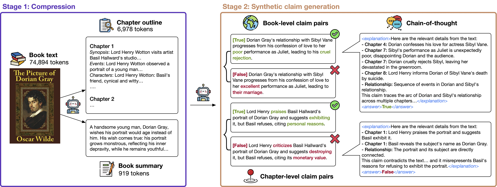

# ✂️ CLIPPER: Compression enables long-context synthetic data generation

[](https://arxiv.org/abs/2406.19371) [](https://huggingface.co/datasets/chtmp223/CLIPPER) [](https://huggingface.co/collections/chtmp223/clipper-67b60b1edbfa3407b571a827) 

This repository hosts the code for our paper, [CLIPPER: Compression enables long-context synthetic data generation](). 



✂️ CLIPPER is a compression-based approach to generating instruction-following data. CLIPPER works by compressing long-form documents (e.g., books) into smaller, information-rich representations (e.g. chapter outlines), which are then used to create grounded instructions for tasks like *narrative claim verification*.

## 📣 Updates
- **[2025-02-19]**: Dataset and models for CLIPPER are now available as a Huggingface collection: [link](https://huggingface.co/collections/chtmp223/clipper-67b60b1edbfa3407b571a827). 


## 📦 Using CLIPPER
### Getting Started
1. Install the requirements for CLIPPER:
    ```
    conda create -n clipper python=3.10 
    conda activate clipper
    pip install -r requirements.txt
    python -m pip install flash-attn --no-build-isolation
    huggingface-cli login       # Log in to Huggingface using your access token 
    sudo apt-get install git-lfs
    ```
2. Set up Huggingface cache directory:
    - Open your shell configuration file, which is typically `~/.bashrc` or `~/.bash_profile` for Bash, or `~/.zshrc` for Zsh. 
    - Add `HF_HOME` huggingface cache directory path to your configuration file: `HF_HOME=/path/to/huggingface_cache`.
    - Add `HF_TOKEN` huggingface access token to your configuration file: `HF_TOKEN=<your_token>`. 
    - Save and close the file. Source the file to apply the changes: `source ~/.bashrc` or `source ~/.bash_profile` or `source ~/.zshrc`.
    - Double-check that the environment variable is set correctly: `echo $HF_HOME`. 


### Project Structure
```
.
├── README.md
├── assets
├── data
    ├── books 
    ├── outputs
    └── wp
├── prompts
└── scripts
    ├── clipper
    ├── eval
    └── wp
```
- `data` contains all books as well as output chapter outlines and summaries used in the paper.
    - `books` contains all books used in the paper. Each subdirectory contains the segmented chapters of a book. The corresponding full book is also available in the `books` directory. 
        - `gutenberg.csv` contains the metadata for the Gutenberg books used in the paper. 
        - New books should be cleaned and chapterized. 
    - `outputs` contains all output chapter outlines and summaries used in the paper. Each subdirectory contains the output for a book, including claims, summaries, and chapter outlines. 
    - `wp` contains the writingprompt raw data (cleaned) and the corresponding generated claims. 
- `scripts` contains code to construct data with CLIPPER: 
    - `eval/inference.py` contains code to do inference with the fine-tuned models on the test set. 
    - `pipeline_*.sh` are bash scripts that run the entire data construction pipeline.
- `prompts` contains all prompts used in the paper. 


### Datasets & Models
- Datasets and models are available in this Huggingface collection: [https://huggingface.co/collections/chtmp223/clipper-67b60b1edbfa3407b571a827](https://huggingface.co/collections/chtmp223/clipper-67b60b1edbfa3407b571a827). 
- We release both CLIPPER and WritingPrompts datasets. 


### Finetuning
- [https://github.com/princeton-nlp/ProLong](https://github.com/princeton-nlp/ProLong): Code to finetune Llama-based models on long sequences.  
- [https://github.com/Qihoo360/360-LLaMA-Factory](https://github.com/Qihoo360/360-LLaMA-Factory): Code to finetune Qwen on long sequences. 


### Evaluation 
- Code to run models on our test set is available in the `scripts/eval/inference.py` directory. 
- We use [NoCha](https://github.com/marzenakrp/nocha/), [Language Model Evaluation Harness](https://github.com/EleutherAI/lm-evaluation-harness), and [HELMET](https://github.com/princeton-nlp/HELMET) to obtain results for external benchmarks. 

## 📜 Citation
```

```